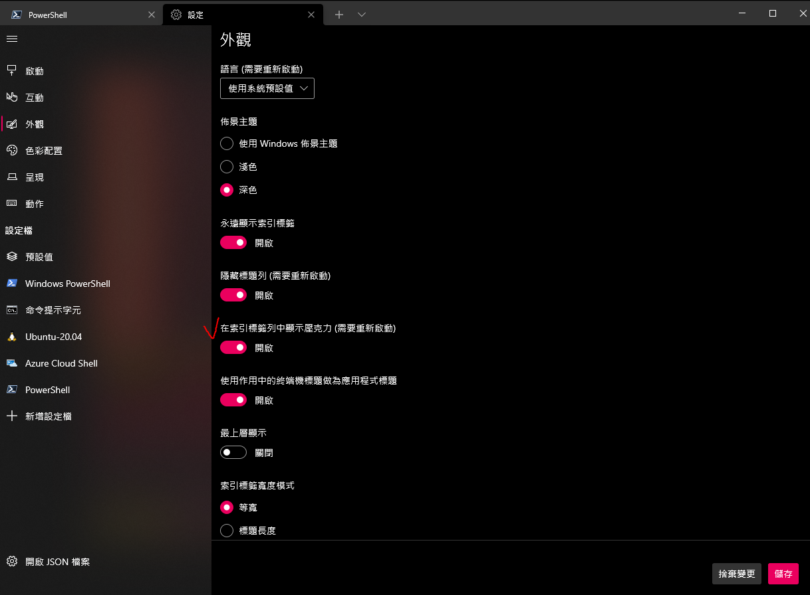
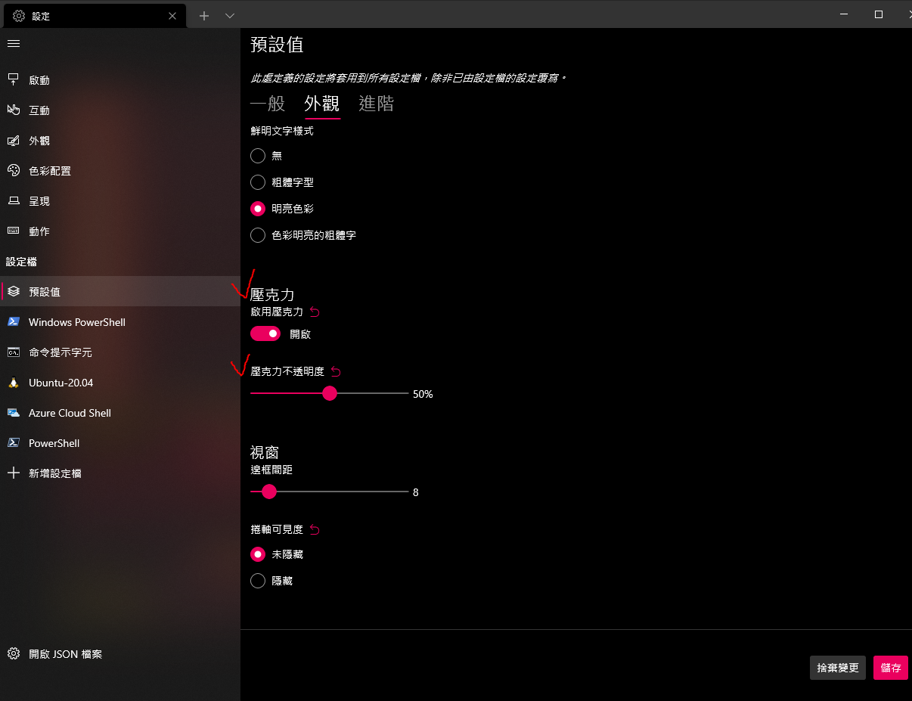
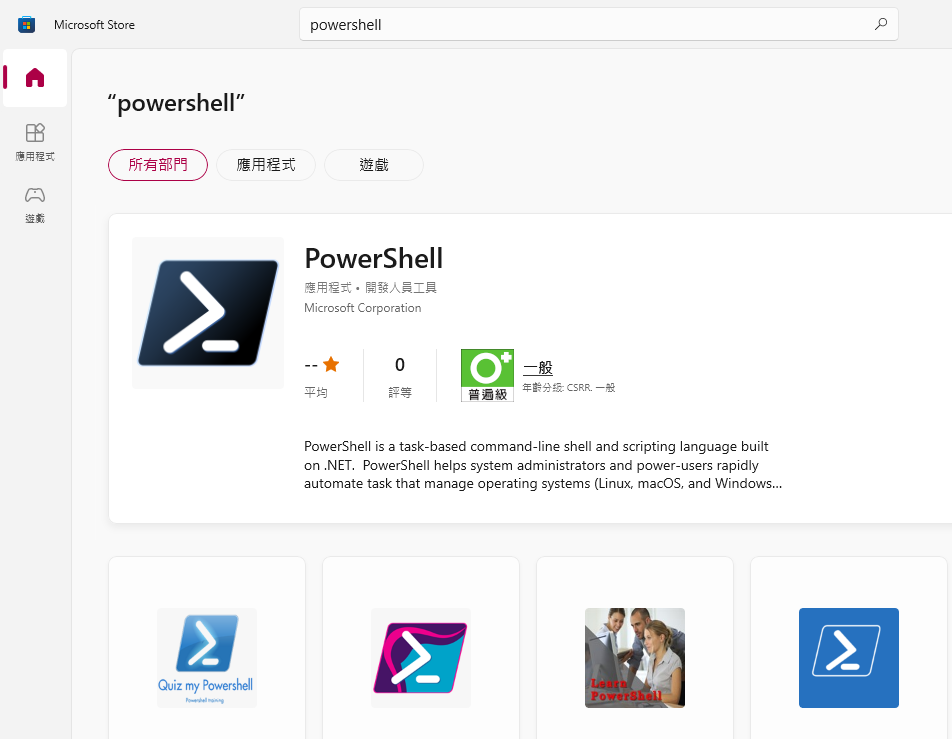
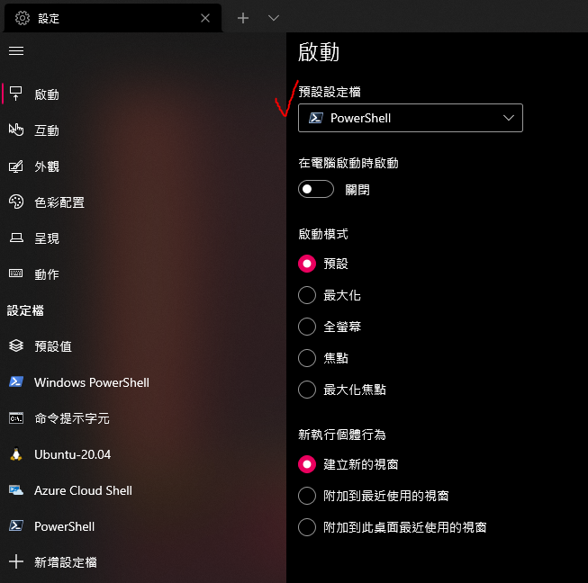
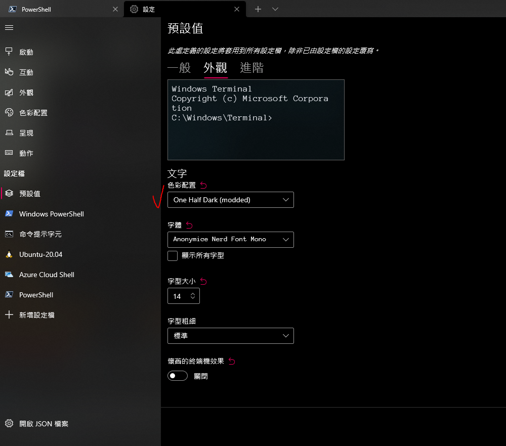

工作上使用 Mac 有 [iTerm2](https://iterm2.com/) + [oh my zsh](https://ohmyz.sh/)，還有 [autosuggestions](https://github.com/zsh-users/zsh-autosuggestions)（解救蒼生 QQ）

雖然家裡 Windows 電腦安裝了 WSL，但有時使用 `gcloud`、`kubectl`，會有很慢的問題

PowerShell 又一直覺得難看且不好用 XD，因此搜尋了一下怎麼修改 Windows Terminal

主要是筆記給未來換新電腦的自己，以及分享給有需要的人

<!--truncate-->

## 修改 font

1. download [Nerd Fonts](https://www.nerdfonts.com/font-downloads)

2. 解壓縮後找到喜歡的字體，安裝檔名後面是 `Windows Compatible.ttf` 的檔案

   

3. Windows Terminal 更改字體

   

## 修改透明度

1. 點開啟

   

2. 開啟壓克力，並調整透明度

   

就會看到 terminal 變透明了！

:::info
💡 這邊要注意的是，Windows 設定的`透明效果`要記得開啟，不然 terminal 設定的透明會無效
:::


## Install PowerShell

1. open `Microsoft Store` and find `PowerShell`

   

2. 將 PowerShell 改成預設

   

## 修改 terminal 色彩配置

1. 打開 Windows Terminal 設定檔

   

2. 首先搜尋原本就有的 `One Half Dark` 如下

   ```json
   {
     "background": "#282C34",
     "black": "#282C34",
     "blue": "#61AFEF",
     "brightBlack": "#5A6374",
     "brightBlue": "#61AFEF",
     "brightCyan": "#56B6C2",
     "brightGreen": "#98C379",
     "brightPurple": "#C678DD",
     "brightRed": "#E06C75",
     "brightWhite": "#DCDFE4",
     "brightYellow": "#E5C07B",
     "cursorColor": "#FFFFFF",
     "cyan": "#56B6C2",
     "foreground": "#DCDFE4",
     "green": "#98C379",
     "name": "One Half Dark",
     "purple": "#C678DD",
     "red": "#E06C75",
     "selectionBackground": "#FFFFFF",
     "white": "#DCDFE4",
     "yellow": "#E5C07B"
   }
   ```

3. 再複製貼上一個新的，並修改 `background` & `name`

   ```json
   {
     "background": "#001B26", // 修改 background
     "black": "#282C34",
     "blue": "#61AFEF",
     "brightBlack": "#5A6374",
     "brightBlue": "#61AFEF",
     "brightCyan": "#56B6C2",
     "brightGreen": "#98C379",
     "brightPurple": "#C678DD",
     "brightRed": "#E06C75",
     "brightWhite": "#DCDFE4",
     "brightYellow": "#E5C07B",
     "cursorColor": "#FFFFFF",
     "cyan": "#56B6C2",
     "foreground": "#DCDFE4",
     "green": "#98C379",
     "name": "One Half Dark (modded)", // 修改 name
     "purple": "#C678DD",
     "red": "#E06C75",
     "selectionBackground": "#FFFFFF",
     "white": "#DCDFE4",
     "yellow": "#E5C07B"
   }
   ```

4. 改成剛剛的顏色配置

   

## Install [Scoop](https://scoop.sh/)

- command-line installer for Windows

```bash
# install scoop
iwr -useb get.scoop.sh | iex

# install some packages
scoop install curl sudo jq

# check install successfully
curl 'https://api.inkdrop.app/' | jq .
```

## Install [NeoVim](https://neovim.io/)

```bash
# install neovim
scoop install neovim gcc

# check install successfully
nvim
```

使用 `nvim` 可能不符合使用習慣，待會會再做修改

## Customize PowerShell config file

1. 建立 `user_profile.ps1` 然後編輯

   ```bash
   cd ~

   nvim .config/powershell/user_profile.ps1
   ```

2. user_profile.ps1 加入 alias

   ```bash
   # Alias
   Set-Alias vim nvim
   Set-Alias grep findstr
   ```

3. 編輯電腦的 `$PROFILE`

   ```bash
   nvim $PROFILE.CurrentUserCurrentHost

   # 加入這段，讓 $PROFILE 指向自製的 user_profile.ps1
   . $env:USERPROFILE\.config\powershell\user_profile.ps1
   ```

之後可以試試直接用 `vim` or `grep` 測試有沒有成功

## Install [oh-my-posh](https://github.com/JanDeDobbeleer/oh-my-posh)

1. install posh-git and oh-my-posh

   ```bash
   Install-Module posh-git -Scope CurrentUser -Force
   Install-Module oh-my-posh -Scope CurrentUser -Force
   ```

2. 修改 `user_profile.ps1`

   ```bash
   cd ~

   vim .config/powershell/user_profile.ps1
   ```

3. 加入

   ```bash
   # Prompt
   Import-Module posh-git
   Import-Module oh-my-posh
   Set-PoshPrompt powerlevel10k_lean
   ```

之後可能要開新的 terminal session，或是重開 terminal 才會開始安裝，然後會看到新的 theme

## Install [Terminal-Icons](https://github.com/devblackops/Terminal-Icons)

```bash
Install-Module -Name Terminal-Icons -Repository PSGallery -Force

Import-Module Terminal-Icons
```

## Install [PSReadline](https://github.com/PowerShell/PSReadLine)

```bash
# install PSReadline
Install-Module -Name PSReadline -AllowPrerelease -Scope CurrentUser -Force -SkipPublisherCheck

# autocompletion
Set-PSReadLineOption -PredictionSource History

# option (config that I don't use)
Set-PSReadLineOption -PredictionViewStyle ListView
```

## Other [themes](https://ohmyposh.dev/docs/themes)

測試時 terminal 輸入，就可以看到改變的 theme，確定要用時記得加入 `user_profile.ps1`

```bash
Set-PoshPrompt [theme_name]
```

## Reference

主要節錄自這個影片：[How to set up PowerShell prompt with Oh My Posh on Windows 11](https://www.youtube.com/watch?v=5-aK2_WwrmM&list=LL&index=1&ab_channel=devaslife)
